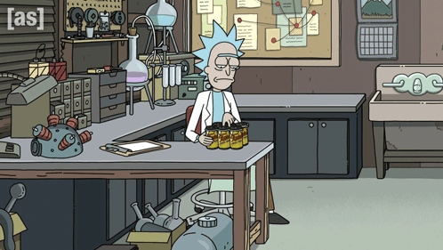
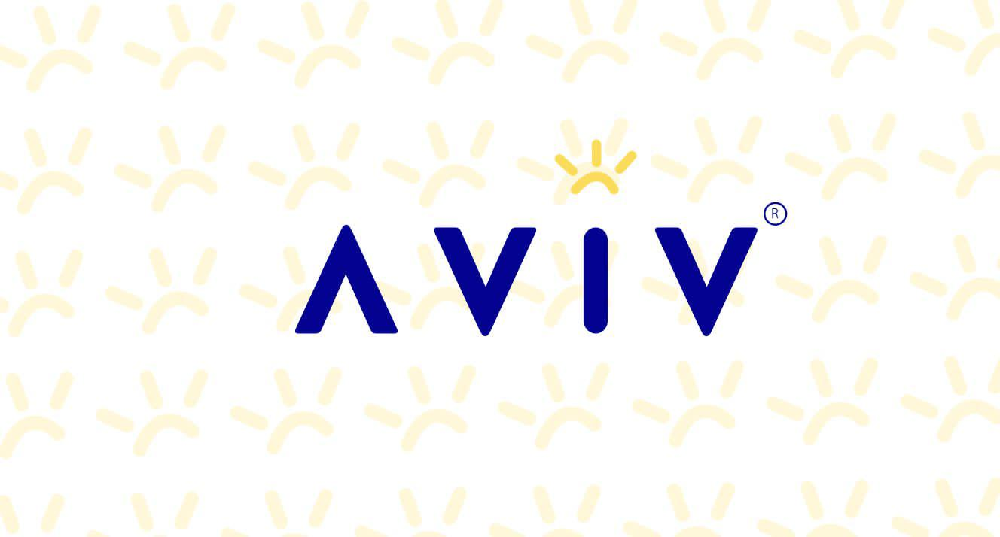

<div align="center">

<!-- AVIV ANIMATED BACKGROUND (name + role baked in, scrolling sun pattern) -->


<!-- TYPING TAGLINE -->
<a href="https://git.io/typing-svg">
  
</a>

<!-- QUICK CONTACT / CTA -->
<p align="center">
  <a href="https://github.com/Mira-Spacee">
    
  </a>
  <a href="https://www.linkedin.com/in/mirko-awat-067924372">
    
  </a>
  <a href="mailto:mirko.awatf21@komar.edu.iq">
    
  </a>
</p>

<!-- LIVE META -->
<p align="center">
  
  
  
</p>

</div>

---

## 👨‍💻 About Me

<table>
  <tr>
    <td width="60%" valign="top">

I am a **Computer Engineer, Robotics Specialist, and AI Systems Builder** based in **Sulaymaniyah, Kurdistan, Iraq **.

My technical work is centered on building practical and intelligent systems across:

- Hardware engineering  
- IoT and embedded systems  
- Web application platforms  
- Smart automation pipelines  
- AI and agentic orchestration  
- Systems architecture for scalable deployment  

I focus on end-to-end engineering: from sensing and control at the device level, to backend intelligence, to human-centered web interfaces that support real operational environments.

```yaml
name: "Mirko Awat Mahmood"
role: "Computer Engineer | Robotics & AI Systems"
location: "Sulaymaniyah, Kurdistan, Iraq"
focus:
  - Hardware Engineering
  - IoT & Embedded Systems
  - Web Application Development
  - Smart Systems & Automation
  - AI & Agentic Architectures
  - Scalable Systems Design
values:
  - Technical leadership and ownership
  - High-pressure project execution
  - Engineering education and mentorship
  - Cross-disciplinary coordination
```

</td>
    <td width="40%" align="center" valign="top">
      
      <br/><br/>
      
    </td>
  </tr>
</table>

---

## 🎯 What I'm Good At

<div align="center">

<table>
  <tr>
    <td width="33%" valign="top" align="center">
      <h3>🌐 Web Applications</h3>
      <p align="left">
      • Robust full-stack implementation<br>
      • Responsive and production-oriented interfaces<br>
      • Maintainable architecture & code quality<br>
      • Performance-aware engineering practices
      </p>
    </td>
    <td width="33%" valign="top" align="center">
      <h3>🔌 IoT, Embedded & Robotics</h3>
      <p align="left">
      • Device-level integration and control logic<br>
      • Embedded workflows and telemetry pipelines<br>
      • Robotics prototyping and smart automation<br>
      • Hardware-to-cloud systems thinking
      </p>
    </td>
    <td width="33%" valign="top" align="center">
      <h3>🧠 AI & Intelligent Systems</h3>
      <p align="left">
      • Agentic automation and task orchestration<br>
      • AI-enabled decision-support systems<br>
      • Intelligent systems architecture design<br>
      • Building adaptive, scalable engineering systems
      </p>
    </td>
  </tr>
</table>

</div>

---

## 🧠 Core Skillset

<div align="center">

### Frontend Engineering


### Backend, APIs & Platforms


### IoT, Embedded & Robotics


### Data & Cloud


</div>

---

## 🗂️ Selected Tech Stack Snapshot

<div align="center">

<table>
  <tr>
    <td align="center" width="25%">
      
      <br/>
      <b>React & Next.js</b>
    </td>
    <td align="center" width="25%">
      
      <br/>
      <b>Python & AI Systems</b>
    </td>
    <td align="center" width="25%">
      
      <br/>
      <b>C / C++ & Embedded Robotics</b>
    </td>
    <td align="center" width="25%">
      
      <br/>
      <b>Docker & Cloud</b>
    </td>
  </tr>
</table>

</div>

---

## 🏛️ Academic & Leadership Highlights

**Founder & President, AVIV Robotic Lab** (2024–2026)  
Leading a research and development lab focused on robotics, automation, and intelligent systems engineering.

**Teaching Assistant, Robotics and Physics II** (2024–2025)  
Supporting student learning in advanced robotics concepts and physics applications.

**Computer Engineering Representative, Student Council** (2023–2025)  
Advocating for departmental interests and fostering collaboration within the student body.

**Organizer of Departmental Flagship Panel: IoT & Robotics in the Middle East** (2024)  
Curating high-impact technical dialogue and industry insights for the engineering community.

**Huawei ICT Academy IoT Foundations — Certified**  
Formal recognition of expertise in IoT foundations and deployment strategies.

**Academic Excellence Award** — Recipient for departmental contribution and leadership  

---

## 📊 GitHub Overview

<div align="center">
  
  <br/><br/>
  
  <br/><br/>
  
</div>


---

## 📬 Let's Connect

<div align="center">

I'm **open to**:

- 💼 Freelance & contract work  
- 🌍 Remote jobs  
- 🤝 Collaborations & open-source  
- 🧠 Technical discussions & mentorship  

<br/>

<a href="mailto:mirko.awatf21@komar.edu.iq">
  
</a>
<a href="https://www.linkedin.com/in/mirko-awat-067924372">
  
</a>
<a href="https://github.com/Mira-Spacee">
  
</a>

</div>

---

<div align="center">


</div>
